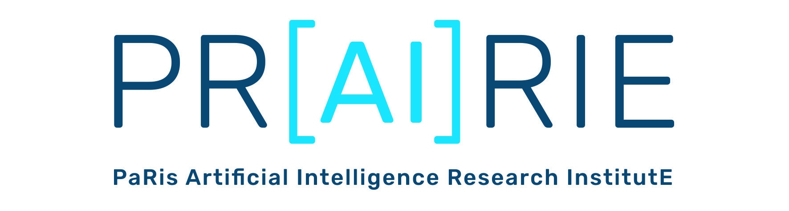

# Ludii AI Competition - 25th Computer Olympiad 2022

## News
To stay up-to-date with any new announcements about Ludii or the Ludii AI Competition, please check:
1. Our Twitter: https://twitter.com/ludiigames
2. Our forums: https://ludii.games/forums/forumdisplay.php?fid=26

---

## Table of Contents
- [Summary](#summary)
- [Competition Prizes](#competition-prizes)
- [Participation](#Participation)
- [Important Links](#important-links)
- [Important Dates](#important-dates)
- [Competition Games](#competition-games)
- [Implementing Agents](#implementing-agents)
- [Competition Rules](#competition-rules)
- [Contact Info](#contact-info)
- [Acknowledgements](#acknowledgements)

---

## Summary
The Ludii AI Competition involves **general game playing events** focussed on developing agents that can play a wide variety of board games. The events use the Ludii general game system to provide the necessary games and API. Games will be provided in the Ludii game description format (*.lud). The version used for this competition (1.3.2) of Ludii includes over 1,000 games.

Three events are proposed:
- Kilothon: Best utility obtained on more than 1,000 games against UCT.
- General Game Playing (GGP): Competiton on games present or not in our library.
- Learning: A set of games are announced months before the actual competition, the agents are invited to learn before competing.

Each event will run if at least 3 participants take part in it.

## Competition Prizes
- This year, a total prize of **9,000 euros** for the three events is funded by Tristan Cazenave (https://www.lamsade.dauphine.fr/~cazenave/) with his PaRis Artificial Intelligence Research InstitutE (PR[AI]RIE: https://prairie-institute.fr/) chair.
- For each event, the winner will receive €3,000. The winners of each event are also going to be invited to write a paper for the first Ludii/DLP conference (happening in 2023).
- Each entrant can enter all three events, but only one agent per event.

## Participation
To participate in any of the events, please send an email to ludii.games@gmail.com to register, with your first and last name, the name of your agent and a contact email address. It would also be appreciated if you register on the Ludii forum and provide your username, but this is not required (https://ludii.games/forums/member.php?action=register). Please also send us a short description (an abstract) of your agent before the event, if you are able to.

The agents for all events will be run on your own machine, so it would be appreciated if you tell us the configuration you are using.

All agents should be implemented according to the Ludii Java AI API or the Ludii Python AI API (however if a participant can implement a wrapper to Ludii in any other languages, this is also allowed.). We also encourage entrants (especially winners) to make their source code available after the competition or to share it (privately) with us (this is not a requirement). We will not share this source code with third parties, but do encourage entrants to provide their work as open source if possible.

Entrants can not just use direct copies of the open source Ludii AIs! If they use Ludii AIs as a basis, an abstract description of the agent should be provided and should describe how it is different to Ludii AI.

## Important Links
- Main Ludii website: https://ludii.games/
- Ludii competition repository: https://github.com/Ludeme/LudiiAICompetition
- Ludii Java AI repository: https://github.com/Ludeme/LudiiExampleAI 
- Ludii Python AI repository: https://github.com/Ludeme/LudiiPythonAI
- Ludii competition forum: https://ludii.games/forums/forumdisplay.php?fid=26
- Ludii Tutorials: https://ludiitutorials.readthedocs.io/
- Ludii source code repository: https://github.com/Ludeme/Ludii
- Ludii User Guide: https://ludii.games/downloads/LudiiUserGuide.pdf
- Ludii Video Tutorial to run an external AI agent: https://www.youtube.com/watch?v=iWXAQZ1p_6c
- Kilothon Tutorial: https://youtu.be/bEdJqyUQ1Hg
- Ludii Video Tutorial to play remotely with an AI agent: https://youtu.be/vl69mx7p7zM

## Important Dates
- March/April 2022: Learning track games will be announced over March and April.
- February-July 2022: Possibility to run agents on the Kilothon track.
- End of July 2022: The GGP and Learning tracks will be run as part of the 25th Computer Olympiad (http://icga.org/), which will be held in conjunction with IJCAI 2022 (https://ijcai-22.org/) in July. The results will be announced at the conclusion of the Computer Olympiad.

## Competition Games
The competition will use a set of games. These will all be implemented in Ludii’s *.lud format, and run using Ludii. 

For the 2022 edition of the Ludii AI competitions, all games will be guaranteed to be:
- Adversarial
- Turn-based
- Sequential
- Fully observable

## Implementing Agents
All agents are expected to extend the “AI” abstract class provided by Ludii. This means that agents are expected to be implemented in Java. We also provide a [Ludii Python AI repository](https://github.com/Ludeme/LudiiPythonAI) which shows how a simple Java wrapper to implement this class can be used around a Python-based AI implementation.

During the competition, agents will have access to a “Forward Model” of the game they are playing at that time. They will have access to the “Game” object (containing e.g. the rules of the game), and they will be told which role they are expected to play (i.e. Player 1 or Player 2).

Whenever an agent is expected to make a move, it can:
- Observe (a copy of) the current game state.
- Make copies of any game state.
- Query any game state for the list of legal moves in that state.
- Apply a move to a game state, which causes it to transition into the next state.
- Query any game state for information about that state -- such as the player to move in that state, whether or not it is already over (and what the outcome is), etc.
- Return the move that it wishes to make.

## Competition Rules

### Kilothon Event

The kilothon is a new type of AI challenge in which participants do not compete directly against each other but try to win the maximum of games against a simple UCT (Upper Confidence Tree) agent for over 1,000 games in the Ludii database. 

For each game, only one minute of ("smart") thinking time is allocated to the challenger. After this time, the agent will be forced to play randomly until the end of the game. Participants can distribute this minute of thinking time as they wish for their agent. The same rule is applied to the UCT agent, which will use 0.5s of thinking time per move during this "smart" minute and then play randomly.

Challengers take the role of Player 1 in all games, with the UCT agent taking the role of Player 2 (and all other roles if the game has more than two players).

All Ludii games annotated as (#competition-games) will be used in the Kilothon. This comes to 1,094 games in version 1.3.2.

In the unlikely case that two entrants tie on success rate, the total number of decision moves made by each agent will be used to break the tie.

To run the Kilothon, implement a main method in your code calling the following method **Kilothon.main(final String[] args);** with arguments:
- username
- agent name

The name of the agent would have to be the name of the agent implemented by the participant, e.g. Kilothon.main(new String[]{"fred_smith", "Freds_Agent"});

For information on running a Kilothon from an agent made with the Java API, check this video: https://youtu.be/bEdJqyUQ1Hg
  
After each Kilothon game is played, the rank of Player 1 and its obtained utility score (between -1 and 1) are stored. The Kilothon ends when all games are completed, and the results of your agent (i.e. Player 1) will be sent by mail to us and the message "Mail successfully sent! Congratulations to have played a complete kilothon!" will be printed to your terminal. The Kilothon results should also be available to you in a *.csv in the same folder as the *.jar file run.
  
  **<b>Be careful</b>, a full Kilothon takes close to a day to complete. Do not stop the Kilothon before seeing the completion message printed to your terminal! Also, ensure that your machine has a working internet connection when your Kilotohon completes or your results will not be sent to us. **

  
  
  
  
### General Game Playing (GGP) Event

The General Game Playing (GGP) event involves a Swiss tournament style run over six rounds. In each round, a new game will be provided and each participant will face another participant, playing the new game twice (each starting once as Player 1). The games to be played will not be named or provided to the agents beforehand. 
  
Each agent will have 30 minutes of thinking per match, which can be allocated as desired. If this time expires before the the match ends, then the offfending agent immediately loses. 
  
All matches must be played using the remote mode of Ludii, which requires participants to register on the Ludii forum and log in to connect using Ludii's "remote" mode. See this video for a short tutorial: https://youtu.be/vl69mx7p7zM. The Ludii User Guide also provides more details about using the remote mode: https://ludii.games/downloads/LudiiUserGuide.pdf

All the matches will be played during the 25th Computer Olympiad (End of July). The different matches will be announced each morning by the organizing team and the matches run during the day. All agents are required to stay online during the competition to be able to run the matches with their allocated opponents. 
  
On this track, all the two-players games in Ludii following the requirement of ([Competition Games](#competition-games)) can be used.  
  
Note: Depending on the number of submissions we receive, the number of competition rounds may be changed. 
  
  
  
### Learning Event

This track is following the same rules of the GGP except the games are going to be revealed during March and April. This allows the participants to prepare for the competition in (for example) making their agent learn more about these games before the competition.  These games are all selected by the organisers of the competition.

  
  
  
  
  
## Contact Info
The preferred way to contact us with any suggestions or questions about the competition is to use the section for competitions on the Ludii forums (https://ludii.games/forums/forumdisplay.php?fid=26). This also enables other interested people to see the responses.

Alternatively, suggestions and questions may be emailed to: ludii.games@gmail.com 

These competitions are run by the members of the Digital Ludeme Project (http://ludeme.eu/people/).

  
  
  
  
## Acknowledgements

This repository is part of the European Research Council-funded Digital Ludeme Project (ERC Consolidator Grant \#771292), being run by Cameron Browne at Maastricht University's Department of Data Science and Knowledge Engineering. All prizes are funded by the PaRis Artificial Intelligence Research InstitutE (PR[AI]RIE: https://prairie-institute.fr/) thanks to Tristan Cazenave (https://www.lamsade.dauphine.fr/~cazenave/).

  

  

  
  
    
  

  
